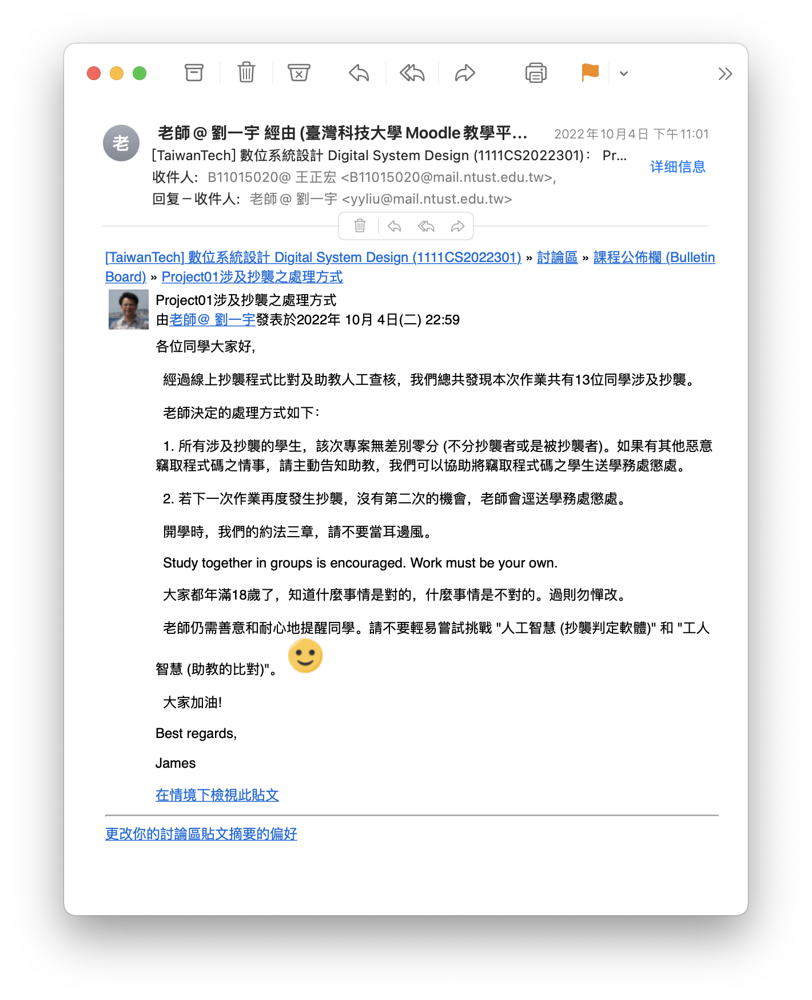

<h1>
    NTUST-1111-Digital-System-Design
    
台科大資工系數位系統設計

</h1>

[會開在下學期的數位電子導論(DigitalElectronics)](https://github.com/ChengHung-Wang/NTUST-1102-DigitalElectronics)

### Projects:
#### Project01: 
[ROBDD Minimization(Written by C)](https://github.com/ChengHung-Wang/NTUST-1111-Digital-System-Design/tree/main/Projects/Project01)

#### Project02: 
[Exact Boolean Minimization](https://github.com/ChengHung-Wang/NTUST-1111-Digital-System-Design/tree/main/Projects/Project02)

#### Project03: 
[State Minimization](https://github.com/ChengHung-Wang/NTUST-1111-Digital-System-Design/tree/main/Projects/Project03)

----
##### 給學弟妹們的話：

不要抄襲，不要抄襲，不要抄襲。
即使你認為你是「參考」。
也不要跟別人一起寫，免得解決方案很像變成抄襲

----
### ProjectFPGA: 

    
    
就是這個東西喔

